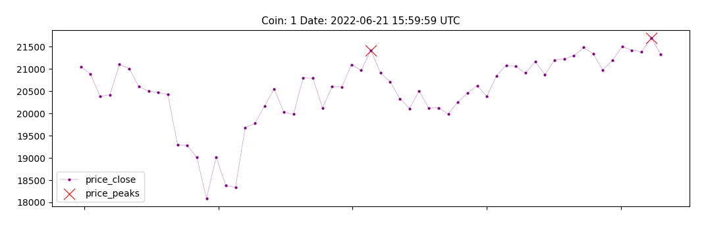
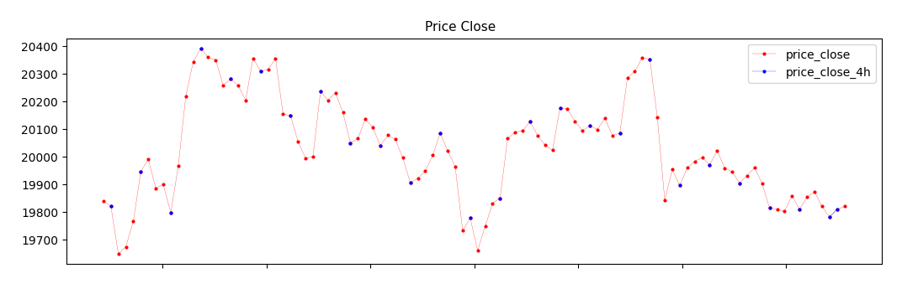

# patlib

## Data

Test data has been added in the `data` directory. If you need more data feel to send me a DM on Telegram @martbar13.

## Conventions

- Time series are in ascending format.

## Examples

### Testing a pattern

To visually inspect the quality of a pattern detection script we can plot a few examples.
To plot examples of a pattern run the following command:

To plot examples of a pattern run the following command:

```python -m scripts.patterns.<pattern_name>.test.run```

where `<pattern_name>` is the name of the pattern you want to generate examples of. 

Plots are saved to the `scripts/patterns/<pattern_name>/test/plots` directory.

Example of plot generated testing the `peaks` pattern:



### Testing an indicator

To test and indicator run the following command:

```python -m scripts.patterns.<pattern_name>.test.run```

This will produce the following files (inside the `scripts/indicators/<indicator_name>/test` directory):

- `indicator_plot.png`
- `indicator_records.md`

Example of `indicator_plot.png` for `price_close` indicator:



Example of `indicator_records.md` for `price_close` indicator:

|   timestamp |   price_close |   price_close_4h |
|------------:|--------------:|-----------------:|
| 1.66219e+09 |       19814.4 |          19814.4 |
| 1.6622e+09  |       19808.8 |            nan   |
| 1.6622e+09  |       19803.6 |            nan   |
| 1.6622e+09  |       19858.5 |            nan   |
| 1.66221e+09 |       19809.4 |          19809.4 |
| 1.66221e+09 |       19853.5 |            nan   |
| 1.66221e+09 |       19872.9 |            nan   |
| 1.66222e+09 |       19820.5 |            nan   |
| 1.66222e+09 |       19782   |          19782   |
| 1.66222e+09 |       19809.2 |          19809.2 |
| 1.66223e+09 |       19820.1 |            nan   |